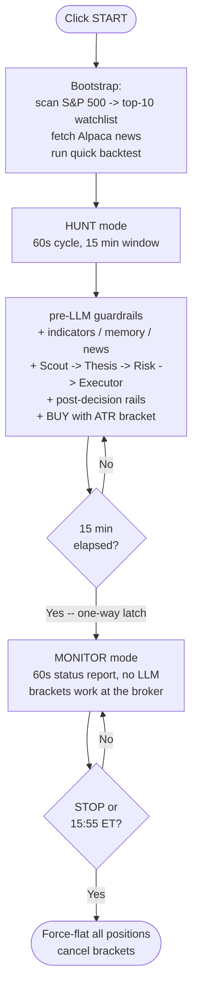

# Clawdbot Trader

An AI-assisted U.S.-equity paper-trading workbench. A desktop GUI scans the S&P 500 for an actionable session watchlist, runs a quick replay backtest on it, then feeds a staged multi-role LLM decision pipeline through deterministic risk rails before submitting Alpaca paper orders. A long-term memory layer learns from outcomes and a setup scorecard auto-pauses weak patterns.

> **Educational and research use only.** Nothing here is financial, investment, legal, tax, or trading advice. All trading involves risk, including loss of capital. Paper-trade carefully before considering any real-money use.

---

## Table of contents

- [What's in the box](#whats-in-the-box)
- [Architecture at a glance](#architecture-at-a-glance)
- [Entry points](#entry-points)
- [The live trading pipeline](#the-live-trading-pipeline)
  - [1. Session bootstrap](#1-session-bootstrap)
  - [2. Per-cycle trading loop](#2-per-cycle-trading-loop)
  - [3. Staged LLM decision](#3-staged-llm-decision-pipeline)
  - [4. Risk rails](#4-risk-rails)
  - [5. Order submission with ATR bracket](#5-order-submission-with-atr-bracket)
  - [6. Memory and scorecard feedback](#6-memory-and-scorecard-feedback)
- [Technical indicator suite](#technical-indicator-suite)
- [Sector / theme concentration](#sector--theme-concentration)
- [Memory and learning](#memory-and-learning)
- [Sentiment temperature](#sentiment-temperature)
- [Quick backtest vs. policy backtest](#quick-backtest-vs-policy-backtest)
- [MCP services (backtest agent)](#mcp-services-backtest-agent)
- [Installation](#installation)
- [Common commands](#common-commands)
- [Tests](#tests)
- [Repo layout](#repo-layout)
- [Operating notes](#operating-notes)

---

## What's in the box

**Live paper trading (GUI + CLI)**
- `START`, `PAUSE`, `STOP` controls; thread-safe console; sentiment gauge; trade count + session P&L
- Provider switcher: DeepSeek (chat / reasoner), OpenAI (gpt-4o / gpt-4o-mini), xAI (grok-2 / grok-3 / grok-3-mini / grok-4)
- S&P 500 universe scan filtered for liquidity and ranked by `|day %chg| x rel_vol`
- Top-10 session watchlist with Alpaca/Benzinga news at startup
- **Per-cycle technical indicator block** (RSI14, SMA5-vs-SMA20 slope, ATR14%, price-vs-VWAP, trend label) injected into the LLM prompt
- **Staged LLM decision pipeline:** scout → thesis → risk → executor
- **Deterministic risk rails** (pre-LLM + post-decision):
  - polled stop-loss / take-profit (failsafe)
  - daily drawdown kill switch
  - cooldown after stop-out, re-entry cooldown
  - force-flat near the close
  - long-only sell validation
  - per-symbol position-size cap
  - per-trade risk budget (capped at 0.50% of equity using stop-distance)
  - theme / sector concentration cap
  - sympathy-trade confirmation
  - paused-setup rejection from the live scorecard
- **Broker-side ATR-scaled bracket orders on every BUY** (1.5x ATR stop, 2.5x ATR take-profit), with graceful fallback to plain market + polled rails if Alpaca rejects the bracket

**Backtesting**
- Quick replay over the live watchlist, with next-bar fills, slippage assumptions, and intrabar stop/target checks
- Standalone policy backtester that produces Sharpe / max-DD / profit-factor / win-rate stats on longer windows
- A separate LangChain-driven multi-day backtest agent (`BaseAgent`, `BaseAgent_Hour`) with full MCP tool use

**Learning and memory**
- Persistent strategy insights, trade outcomes, conversations
- Rolling setup scorecard that promotes, reviews, or pauses patterns from measured live results
- Performance-derived lessons and end-of-session reflection
- Sentiment-aware LLM temperature (SPY/QQQ put-call blend + VIX)

**Quality**
- 94 unit tests covering shared helpers, memory ranking, FIFO performance tracking, sentiment edge cases, quick-backtest helpers, the risk-rail predicates, the backtest stats math, and the scanner

---

## Architecture at a glance



See [docs/LIVE_APP_FLOW.md](docs/LIVE_APP_FLOW.md) for fully-zoomed-in diagrams of each stage.

---

## Entry points

| File | Purpose |
|------|---------|
| `live_trader_gui.py` | Main desktop trading app (Tk) |
| `live_trader.py` | Command-line live trader (same pipeline, no GUI) |
| `strategy_chat.py` | Memory-aware strategy chat; can save insights and inspect stats |
| `main.py` | LangChain-driven multi-day U.S. backtest agent |
| `scripts/backtest_live_policy.py` | Standalone longer-window backtest that prints Sharpe / max-DD / profit-factor for the live policy |
| `START_TRADER.bat` | Windows launcher for the GUI |
| `START_STRATEGY_CHAT.bat` | Windows launcher for strategy chat |

---

## The live trading pipeline

### 1. Session bootstrap

When you click `START` in the GUI, the app runs these steps once before entering the trading loop:

1. **Snapshot session-start equity** (`session_start_value`) — anchors the daily-DD kill switch
2. **Reset session flags** — `kill_switch_tripped=False`, `force_flat_done_today=False`, cooldowns/themes cleared
3. **Run scanner** — `tools/scanner.py` evaluates the S&P 500 snapshot (`data/sp500_symbols.txt`), filters by `min_price`, `min_avg_dollar_vol`, and lookback-volume, scores each symbol by `|day_pct_change| x rel_vol`, returns the top-10 as the session watchlist
4. **Pull startup news** — `tools/alpaca_news.py` hits `https://data.alpaca.markets/v1beta1/news` for ~36h of articles across the watchlist; results are bucketed by symbol and rendered into a "WATCHLIST NEWS CHECK" prompt block
5. **Run the quick backtest** — `tools/quick_backtest.py` replays the recent few hourly bars of the watchlist through the same LLM and prompt shape used for live, with next-bar fills, slippage, and intrabar stop/target checks; output is a session-only prompt block describing bullish/caution biases, equity, and max drawdown
6. **Log the risk-rail config line** — stop-loss %, take-profit %, daily kill %, cooldown minutes, re-entry minutes, per-trade risk %, theme cap %, force-flat time

### 2. Per-cycle trading loop

The bot runs in two modes with a one-way latch — fast hunting at the open, then quiet monitoring once brackets are in place.

**HUNT mode** (`HUNT_INTERVAL_SECONDS = 60`, first `HUNT_WINDOW_MINUTES = 15` from Start)

Each 60s while the market is open:

1. Fetch latest prices for the watchlist via `api.get_latest_bars`
2. **Apply pre-LLM guardrails** (`_apply_guardrails`) -- broker fill reconciliation, force-flat at 15:55 ET, daily-DD kill switch, polled stop/TP failsafes
3. **Refresh the indicator snapshots** -- `tools/live_indicators.py` makes a single batched daily-bar call plus an intraday-bar call, computes RSI14, SMA5, SMA20, SMA5-vs-SMA20 slope %, ATR14, ATR14%, intraday VWAP, price-vs-VWAP %, and assigns a trend label (`BULL_TREND` / `BULL` / `NEUTRAL` / `BEAR` / `BEAR_TREND`)
4. **Compose the prompt's "memory section"** -- relevance-ranked insights, per-symbol track record, the Alpaca news block, the session-only quick-backtest context, and the freshly-fetched **TECHNICAL CONTEXT** block
5. **Run the staged LLM decision** (see [section 3](#3-staged-llm-decision-pipeline))
6. **Apply post-decision rails** (size cap, risk budget, theme cap, cooldowns, sympathy validation, paused-setup check)
7. **Submit the order** with an ATR-scaled broker bracket (see [section 5](#5-order-submission-with-atr-bracket))
8. Record the outcome to memory + scorecard, sleep 60s, repeat

**MONITOR mode** (`MONITOR_INTERVAL_SECONDS = 60`, after the hunt window)

A one-way latch flips HUNT -> MONITOR exactly at the 15-min mark from Start. Bracket fires do **not** shorten the window -- we keep hunting the full 15 minutes whether positions are open or not. Once latched, each 60s:

1. Pre-LLM guardrails still tick (broker fill reconciliation, force-flat, kill switch)
2. Print a status line per open position: `qty @ entry -> current (P/L %) | stop $X (-Y%) | tp $Z (+W%)`, with the live stop/TP read directly from Alpaca (including `held` bracket legs)
3. **No LLM call.** The Alpaca bracket orders are the strategy in this phase.

The latch is one-way -- if positions stop out mid-session, the bot stays in MONITOR. To begin a fresh 15-min hunt window, STOP and START again (this cancels live brackets, so plan accordingly).

### 3. Staged LLM decision pipeline

`request_role_based_ai_decision` (in `tools/live_trading_utils.py`) runs four short LLM passes in sequence. Each gets the shared context + previous stage's structured output. If any stage throws, the pipeline falls back to the legacy single-pass prompt.

| Stage | Role | Output JSON shape |
|-------|------|-------------------|
| 1. Scout | Surveys the tape, picks up to 3 candidates worth attention | `{market_posture, focus_symbols, setups, notes}` |
| 2. Thesis | Proposes exactly one trade idea, or HOLD | `{action, symbol, quantity, setup, confidence, reason, risk_cue}` |
| 3. Risk | Approves, blocks, or trims the thesis | `{approved_action, approved_symbol, approved_qty, block_reason, ...}` |
| 4. Executor | Emits the final JSON order; checked against the risk approval | `{action, symbol, quantity, reason}` |

If the executor's symbol or action disagrees with risk's approval, the order is forced to HOLD.

### 4. Risk rails

Rails fire in two phases. Pre-LLM rails can short-circuit the cycle entirely; post-decision rails can reject, trim, or fully flatten before any order is submitted.

**Pre-LLM (every cycle, before the prompt is built):**

| Rail | Trigger | Action |
|------|---------|--------|
| Force-flat (EOD) | `now_ET >= FORCE_FLAT_HHMM_ET` and we're still in session | Market-sell all positions, set `force_flat_done_today` + `kill_switch_tripped` |
| Daily kill switch | `portfolio_value <= session_start * (1 + DAILY_KILL_PCT/100)` | Flatten everything, latch `kill_switch_tripped` |
| Polled stop-loss (failsafe) | Position P&L% <= `STOP_LOSS_PCT` (default -3%) | Market-sell that symbol, start cooldown |
| Polled take-profit (failsafe) | Position P&L% >= `TAKE_PROFIT_PCT` (default +5%) | Market-sell that symbol |

> The polled stop/TP are a backstop for positions opened without a live broker bracket (rare — see §5). The primary stop is the resting Alpaca order.

**Post-decision (for the LLM's proposed action):**

| Rail | Trigger | Action |
|------|---------|--------|
| Long-only SELL | LLM tries to SELL more than we hold | Trim to actual qty or HOLD |
| Stop-out cooldown | Symbol's `cooldowns[sym]` not yet expired | Reject the BUY |
| Re-entry cooldown | Symbol's `reentry_cooldowns[sym]` not yet expired (15m default) | Reject the BUY |
| Sympathy confirmation | Reason cites a *different* ticker, but target isn't green/near-highs/with strong relvol or own news | Reject the BUY |
| Paused setup | The setup label (extracted from `reason`) is in the scorecard's `paused` list | Reject the BUY |
| Position-size cap | Proposed value > 20% of portfolio | Trim qty |
| Risk budget | qty x stop-distance > 0.50% of equity (`MAX_RISK_PER_TRADE`) | Trim qty so loss-at-stop respects the budget |
| Theme cap | Adding the trade would push the theme's total >40% of equity | Reject the BUY |

### 5. Order submission with ATR bracket

For every BUY that survives the rails, `_submit_buy_with_bracket` computes the bracket prices and submits an Alpaca `order_class='bracket'` market order:

```text
stop_price       = entry - 1.5 x ATR14    (or entry x (1 - 3%) if ATR unavailable)
take_profit_price = entry + 2.5 x ATR14    (or entry x (1 + 5%) if ATR unavailable)
```

The stop and take-profit are **resting Alpaca orders** — they fire even if the bot is offline or the polling cadence misses a fast move. If Alpaca rejects the bracket for any reason (paper-mode quirks, asset class restrictions, etc.) the code falls back to a plain market BUY and the polled `STOP_LOSS_PCT` / `TAKE_PROFIT_PCT` rails still cover the position.

SELLs are submitted as plain market orders; the existing position has already been validated against `enforce_sell_quantity`.

### 6. Memory and scorecard feedback

After each order completes:
- `PerformanceTracker.record_trade` pairs sells against earlier buys via FIFO; partial fills are matched against multiple buy records
- A round-trip with `profit_pct >= 1%` is a `win`; `<= -1%` is a `loss`; otherwise `neutral`
- Meaningful wins / losses generate auto-tagged `performance` insights
- The setup scorecard updates measured-result counters for the trade's setup label
- After enough recent losses on a setup, it moves to `under_review`, then `paused`; paused setups are deterministically rejected by the post-decision rails
- Insights referenced when the trade was opened get win/loss credit (auto-deactivated after `auto_deactivate_after` losses with no wins)

On `STOP`: positions are liquidated, then `reflect_on_session` asks the LLM to distill 1-3 portable rules from today's trades, saved as `reflection`-tagged insights.

---

## Technical indicator suite

`tools/live_indicators.py` exposes pure math + a batched Alpaca fetcher.

| Indicator | Period | Source bars | Used for |
|-----------|--------|-------------|----------|
| RSI14 | 14 daily closes | Alpaca daily bars (`iex` feed) | Overbought/oversold flag in LLM prompt |
| SMA5 / SMA20 / slope | 20 daily closes | Same | Trend strength + label |
| ATR14 / ATR14% | 14 daily true ranges | Same | **Sizing the broker stop-loss / take-profit** |
| VWAP (intraday) | Today's 5-min bars | Alpaca 5Min bars (`iex` feed) | Price relative to today's volume-weighted level |
| Trend label | Composite of SMA slope + price vs SMA20 | — | `BULL_TREND` / `BULL` / `NEUTRAL` / `BEAR` / `BEAR_TREND` |

The block injected into every cycle's prompt looks like:

```text
TECHNICAL CONTEXT (daily indicators, intraday VWAP when available):
- NVDA: RSI14=68 (NEUTRAL), SMA5-vs-SMA20=+3.62%, ATR14=2.34%, px-vs-VWAP=+0.83% (intraday), trend=BULL_TREND
- AMD:  RSI14=42 (NEUTRAL), SMA5-vs-SMA20=-2.35%, ATR14=2.48%, px-vs-VWAP=-0.90% (intraday), trend=BEAR_TREND
```

The same `ATR14` value (in dollars) is passed to `atr_bracket_prices` for the broker bracket — the bot stops and targets adapt to each symbol's recent volatility instead of using a flat 3% / 5%.

---

## Sector / theme concentration

Two complementary caps work together:

1. **Theme cap** (`MAX_THEME_EXPOSURE = 0.40`) — `extract_trade_theme` parses the LLM's `reason` for keywords (storage, semis, cloud, index, etc.) and refuses BUYs that would push a single theme above 40% of equity
2. **Sector map** (`tools/sector_map.py`) — a deterministic symbol → factor mapping (semis, megacap, enterprise_sw, cyber, power_dc, ai_cloud, ai_hardware, robotics, china, adtech, biotech, …); `trim_buy_to_sector_cap` is available as an alternative or additional check

The theme cap is currently the active wall in the GUI; the sector map is loadable and used by `scripts/backtest_live_policy.py` for a static, reason-independent test.

---

## Memory and learning

Memory lives in `data/memory/` as JSONL:

| File | What's in it |
|------|--------------|
| `strategy_insights.jsonl` | Strategy rules: from chat, performance, reflection, backtest |
| `trade_outcomes.jsonl` | Every buy/sell, with FIFO-matched outcomes |
| `conversations.jsonl` | Strategy-chat transcripts |
| `setup_scorecard.jsonl` | Per-setup measured-result history |

Insights are relevance-ranked for each prompt by `(tag-symbol-match) + (Jaccard token overlap) + (Beta-prior win-rate quality) + (recency bias)`, and auto-deactivated after repeated losses with no wins.

**Long-term:** `performance`, `reflection`, manually-saved, and scorecard entries.
**Session-only:** quick-backtest watchlist bias.

---

## Sentiment temperature

`tools/sentiment_temperature.py` maps option-market sentiment to LLM temperature:

- Inputs: blended SPY/QQQ put-call regime signal + VIX
- Modes: `trend_following` (high P/C → low temp), `contrarian` (inverted), or `fixed_temperature` override
- Cached in `data/sentiment/temperature_cache.json` with corrupt-cache recovery

The live GUI displays the current `sentiment_label`, temperature, and put-call ratio in the status bar. The backtest agent applies the value to its `ChatOpenAI(temperature=...)` directly; the live trader uses the staged pipeline's per-stage temperatures (scout 0.25, thesis 0.20, risk 0.10, executor 0.10).

---

## Quick backtest vs. policy backtest

The repo has two different backtesters:

| | Quick backtest (`tools/quick_backtest.py`) | Policy backtest (`scripts/backtest_live_policy.py`) |
|---|---|---|
| When | Once per session, at startup, on the current watchlist | On demand, any window, any symbols |
| Window | 6 recent hourly bars (default) | Configurable (`--days 30` default) |
| Steps | 4 LLM calls max | One LLM call per bar |
| Output | Session-only prompt block ("bullish bias: X", "max DD: Y%") | Full markdown report with Sharpe / max-DD / profit-factor / win-rate / expectancy |
| Slippage | 8 bps/side | Configurable (`--slippage-bps 5` default) |
| Exits | Intrabar stop/target checks | ATR-scaled brackets (1.5x stop, 2.5x TP) simulated bar-by-bar |
| Use | "Should the LLM lean bullish today?" | "Does the live policy have a measurable edge?" |

Run the policy backtest:

```bash
python scripts/backtest_live_policy.py \
    --symbols NVDA,AMD,AVGO,MSFT,META \
    --days 30 \
    --slippage-bps 8 \
    --output data/backtests/report.md
```

---

## MCP services (backtest agent)

These services are consumed by the **LangChain backtest agent** (`BaseAgent` / `BaseAgent_Hour`), not the live trader.

| Port | Service | Script |
|------|---------|--------|
| 8000 | Math | `tool_math.py` |
| 8001 | Search / News | `tool_alphavantage_news.py` |
| 8002 | Trade | `tool_trade.py` |
| 8003 | Price | `tool_get_price_local.py` |
| 8004 | Indicators | `tool_indicators.py` |
| 8006 | Sentiment | `tool_sentiment_temperature.py` |

Start them with:

```bash
python agent_tools/start_mcp_services.py
```

The live GUI does not require any MCP service to be running.

---

## Installation

```bash
pip install -r requirements.txt
```

Required environment values:

```env
# Live trading (Alpaca paper)
ALPACA_API_KEY=...
ALPACA_SECRET_KEY=...
ALPACA_BASE_URL=https://paper-api.alpaca.markets

# At least one LLM provider
OPENAI_API_KEY=...
DEEPSEEK_API_KEY=...
DEEPSEEK_API_BASE=https://api.deepseek.com/v1
XAI_API_KEY=...
XAI_API_BASE=https://api.x.ai/v1

# Optional: the standalone MCP news tool (the live GUI uses Alpaca's news, not Alpha Vantage)
ALPHAADVANTAGE_API_KEY=...

# MCP ports (only used by the backtest agent path)
MATH_HTTP_PORT=8000
SEARCH_HTTP_PORT=8001
TRADE_HTTP_PORT=8002
GETPRICE_HTTP_PORT=8003
INDICATORS_HTTP_PORT=8004
SENTIMENT_HTTP_PORT=8006
```

---

## Common commands

```bash
# GUI live trader
python live_trader_gui.py

# CLI live trader
python -u live_trader.py

# Strategy chat (memory-aware)
python strategy_chat.py
python strategy_chat.py --insight "Avoid chasing extended semiconductor breakouts"
python strategy_chat.py --stats

# Standalone policy backtest (Sharpe / max-DD / profit factor)
python scripts/backtest_live_policy.py --symbols NVDA,AMD,AVGO --days 30 --output data/backtests/report.md

# Multi-day LangChain backtest
python main.py configs/default_day_config.json

# Refresh local price cache
cd data && python get_price_yahoo.py

# Sentiment module smoke test
python tools/sentiment_temperature.py

# Frontend cache refresh
python scripts/precompute_frontend_cache.py
```

---

## Tests

```bash
python -m unittest discover -s tests -v
```

**94 tests** covering:

- shared live-trading helpers and prompt builders
- relevance-ranked memory and FIFO performance tracking
- setup-scorecard promotion / pause behavior
- sentiment and VIX behavior, contrarian inversion
- quick-backtest helpers and prompt-replay fallback
- scanner liquidity filtering and scoring
- Alpaca news fetcher and prompt formatter
- **risk-rail predicates: stop-loss, take-profit, kill switch, force-flat, cooldown, ATR bracket math, sector cap**
- **backtest stats: Sharpe, max-DD, profit factor, slippage, win-rate; plus the indicator math (RSI / SMA / ATR / VWAP)**

---

## Repo layout

```text
agent/
  base_agent/
    base_agent.py            # daily-bar LangChain backtest agent
    base_agent_hour.py       # hourly variant

agent_tools/
  start_mcp_services.py
  tool_alphavantage_news.py  # MCP news (backtest agent only)
  tool_get_price_local.py
  tool_indicators.py         # MCP indicators (backtest agent only)
  tool_math.py
  tool_sentiment_temperature.py
  tool_trade.py

configs/
  default_config.json
  default_day_config.json
  default_hour_config.json

data/
  memory/                    # JSONL: strategy_insights, trade_outcomes, conversations, setup_scorecard
  quick_backtests/           # per-session log directories
  sentiment/                 # cached PC/VIX
  sp500_symbols.txt          # scanner universe

docs/
  LIVE_APP_FLOW.md           # detailed mermaid flow diagrams
  evaluation_rubric.md
  config.yaml
  data/

scripts/
  backtest_live_policy.py    # standalone policy backtester with Sharpe/PF/DD
  precompute_frontend_cache.py
  start_ui.sh, main.sh, ...

tests/                       # 94 unit tests

tools/
  alpaca_news.py             # live-trader Alpaca/Benzinga news fetcher
  backtest_evaluator.py      # Sharpe / max-DD / profit factor / slippage math
  live_indicators.py         # RSI / SMA / ATR / VWAP, batched Alpaca fetcher
  live_trading_utils.py      # staged role pipeline, prompt builders, post-decision rails
  memory_tools.py            # relevance-ranked memory + scorecard
  performance_tracker.py     # FIFO outcome matching
  price_tools.py             # S&P 500 universe, helpers
  quick_backtest.py          # session-startup replay
  risk_rails.py              # pure predicates: stop / kill / force-flat / cooldown / ATR bracket
  scanner.py                 # liquidity-filtered top-mover scorer
  sector_map.py              # symbol -> factor groupings, cap helper
  sentiment_temperature.py
```

---

## Operating notes

- The scanner reads its universe from `data/sp500_symbols.txt`. Update that file to change the search pool.
- Indicator and news fetches use Alpaca's `iex` feed where the SDK accepts it (free tier compatible). The fetcher transparently falls back if `feed=` isn't accepted.
- Bracket orders require `time_in_force='day'` on Alpaca paper; if that's rejected, the code falls back to plain market and polled rails.
- ATR-scaled stops/TPs will be wider on volatile names (ARM, SMCI, IREN) and tighter on slow names (PEP, COST). That's intentional — flat % stops over-stop fast-movers and under-stop slow-movers.
- The quick-backtest "bullish bias" is **session-only** and never written into long-term memory. Long-term insights come from actual closed trades, reflection, and chat.
- A user `STOP` triggers liquidation + reflection but does not clear memory.
- If you change the LLM provider during a session, the quick-backtest cache is invalidated on next `START`.
